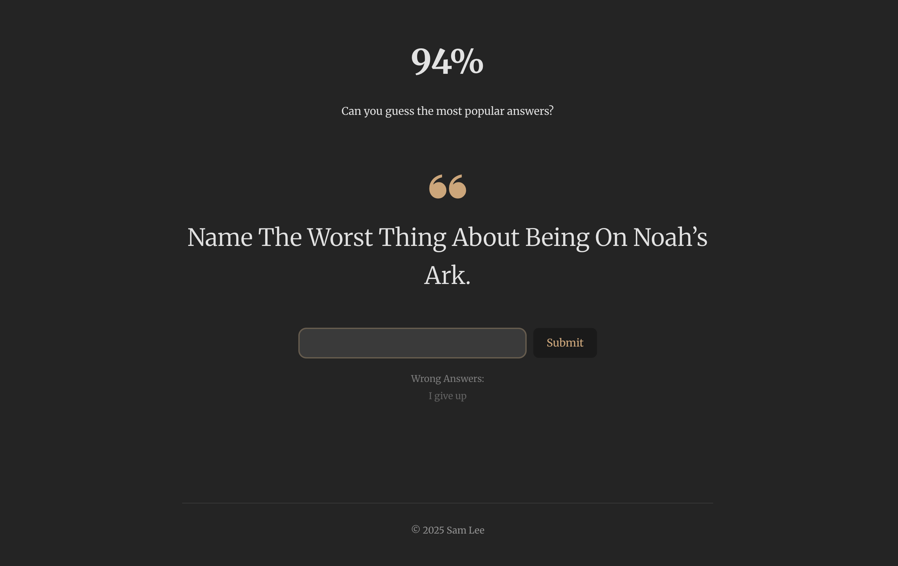

${\color{Tan}\Huge{\textsf{94percent}}}$
---

A web game where players try to guess the most common answers, inspired by the 94% quiz.

## Thanks to

Answered my TypeScript questions and gave me lots of motivation and encouragement to try things on my own
⸺ [Simon Lefort](https://github.com/Androz2091)

Tried it out and threw in a bunch of cool ideas to improve the game
⸺ Doyoon Chung

## Tech Stack

- **Backend**: C# (.NET 10), ASP.NET Core Web API, EF Core
- **Frontend**: React + Vite

## Todo

- add db caching
- exclude seen questions
- animation when completed
